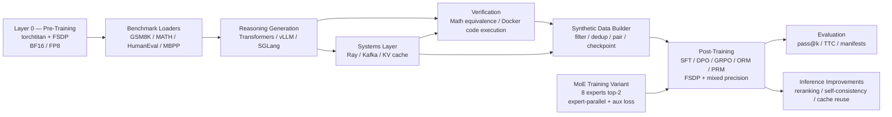
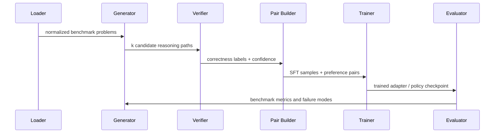

# Distributed Reasoning Loop

**Author:** Dev Desai  
**Focus:** distributed pre-training, post-training with verified rewards, mixed-precision training systems, mixture-of-experts, and high-throughput inference — all in one repository.

Distributed Reasoning Loop (DRL) spans the full model lifecycle: it **pre-trains a small language model from scratch with FSDP and torchtitan**, **post-trains it with SFT / DPO / GRPO and learned reward models**, and **serves it with verified test-time compute**. Every stage shares one training-systems stack — FSDP FULL_SHARD, a BF16/FP8 mixed-precision policy with dynamic loss scaling, distributed checkpointing, and explicit gradient-accumulation boundaries — so the same engineering primitives power Layer 0 pre-training, the post-training algorithms, and the Mixture-of-Experts variant.

The project is built around a simple thesis:

> In domains where answers can be checked automatically, correctness can become scalable supervision — and the surrounding training stack should be built to the same standard as a frontier-lab accelerator team's.

## Results Snapshot

| Benchmark | Task Type | Result |
|---|---|---:|
| GSM8K | grade-school math | **71.0% accuracy** |
| MATH | competition math | **36.0% accuracy** |
| HumanEval | code generation | **42.0% pass@1** |
| MBPP | Python programming problems | **57.0% pass@1** |
| GSM8K pass@k | math reasoning with multiple samples | **35.0% pass@1 -> 70.0% pass@8** |
| GSM8K fine-tuning comparison | base vs GRPO-tuned model | **+20.0 pass@1 points** |

### Fine-Tuning Lift

From `comparison_results.json`:

| Metric | Base Qwen2.5-1.5B-Instruct | Fine-Tuned `./outputs/grpo_model` | Gain |
|---|---:|---:|---:|
| Pass@1 | 35.0% | **55.0%** | **+20.0 pts** |
| Pass@4 | 65.0% | **75.0%** | **+10.0 pts** |
| Pass@8 | 80.0% | **90.0%** | **+10.0 pts** |
| Correct@1 | 7 / 20 | **11 / 20** | +4 |

### Systems Benchmarks

From `throughput_results.json`:

| System Metric | Result |
|---|---:|
| End-to-end pipeline throughput | **49.09 samples/sec** |
| Prefix-cache throughput | **49.50 samples/sec** |
| No-prefix-cache throughput | 19.89 samples/sec |
| Prefix-cache speedup | **~2.5x** |
| Math verifier throughput | **35,526 verifications/sec** |
| Ray scaling, 4 workers | **3.25x speedup**, 81.2% efficiency |

## What It Does

Most reasoning projects focus on one layer: prompting, fine-tuning, evaluation, or infrastructure. DRL connects the full loop across **five layers** that are usually split across three different engineering teams:

0. **Pre-train** a Llama-style decoder from scratch with torchtitan + FSDP FULL_SHARD, BF16/FP8 mixed precision, distributed checkpointing, and online MFU accounting.
1. **Generate** candidate trajectories on GSM8K / MATH / HumanEval / MBPP through `transformers`, `vLLM`, or `SGLang`.
2. **Verify** outputs with symbolic math checks or Docker-isolated code execution, then build preference and SFT artifacts.
3. **Post-train** with SFT, DPO, GRPO, outcome reward models, and process reward models — every trainer wrapped in FSDP and governed by the same precision policy.
4. **Serve** with best-of-n, majority-vote self-consistency, ORM/PRM reranking, speculative decoding, and a prefix-aware KV cache.

A dedicated **Mixture-of-Experts training variant** complements the dense path: 8 experts, top-2 routing, expert-parallel placement on top of FSDP, an auxiliary load-balancing loss, and per-step expert-utilization telemetry.

## Architecture



The core design is deliberately modular: generation, verification, training, and evaluation can be run independently, but the strongest path is the closed loop.



## Core Components

### Layer 0 — Pre-Training

`src/training/pretraining/` pre-trains the project's own base model from scratch under FSDP. Most reasoning repositories skip this layer and post-train someone else's checkpoint; DRL owns the full lifecycle.

- **Model** — a torchtitan-style Llama decoder with RMSNorm, rotary position embeddings, SwiGLU MLPs, grouped-query attention, and tied I/O embeddings. The default configuration targets ~250M parameters (12 layers, d_model 1024, 16 heads).
- **Parallelism** — FSDP `FULL_SHARD` with a transformer-block auto-wrap policy, `BACKWARD_PRE` prefetch, activation checkpointing, and sharded optimizer state.
- **Precision** — BF16 autocast compute with FP32 master weights by default; FP8 path on Hopper / Ada via Transformer Engine.
- **Sequencing** — 2048-token sequences, deterministic per-rank shard reading, AdamW with cosine schedule and linear warmup, global-norm gradient clipping at 1.0.
- **Checkpointing** — `torch.distributed.checkpoint` sharded reads and writes so each rank serializes its slice in parallel.
- **Instrumentation** — online tokens/sec, MFU, gradient-norm trace, learning-rate trace.

Launch a pre-training run with `torchrun --nproc_per_node=4 scripts/pretrain.py --data-dir ./data/pretraining --total-steps 10000 --precision bf16`.

### Distributed Training Systems

`src/training/fsdp_utils.py` centralizes the FSDP wrap, transformer-block auto-wrap policy, mixed-precision settings, activation checkpointing, no-sync gradient accumulation boundaries, and `torch.distributed.checkpoint` save/load helpers. Every trainer in the project — pre-training, SFT, DPO, GRPO, ORM, PRM, and the MoE variant — goes through this module, so the sharded-training behavior is identical across the codebase.

`src/training/precision.py` implements a single mixed-precision policy:

- BF16 or FP8 autocast region selection.
- FP32 master weights via the optimizer's parameter groups.
- Dynamic loss scaling with overflow detect and skip-and-rescale.
- Global-norm gradient clipping with NaN/Inf guards.
- A structured per-step gradient-norm trace for cross-precision stability studies.

`src/training/accelerate_utils.py` bridges the policy to Hugging Face Trainer / Accelerate so SFT, DPO, and the reward-model trainers express FSDP and precision through `TrainingArguments` rather than bespoke wrappers — the precision and FSDP story is identical whether a trainer is running on a raw torch loop (pre-training, GRPO) or on the HF stack (SFT, DPO).

### Mixture-of-Experts Training Variant

`src/training/moe/` complements the project's existing MoE serving analysis with a full *training-side* path.

- **Model** — the Titan decoder with each FFN replaced by a top-k softmax-routed mixture of SwiGLU experts.
- **Defaults** — 8 experts, top-2 routing, tunable `expert_parallel_size`.
- **Load balancing** — Switch-Transformer-style auxiliary load-balancing loss and router z-loss, each with its own coefficient.
- **Telemetry** — every forward pass returns a `RoutingStats` record containing the per-expert token histogram, per-layer routing CoV, and aggregate auxiliary/z-loss terms. The trainer logs and persists these so expert imbalance is visible live.

Launch a MoE run with `torchrun --nproc_per_node=4 scripts/train_moe.py --n-experts 8 --top-k 2 --total-steps 5000`.

### Precision Study

`scripts/precision_study.py` sweeps FP32, BF16, and FP8 across an identical training window and writes a JSON report covering throughput, peak memory, mean loss, gradient-norm mean/std, and overflow-step counts per precision. The throughput speedup column is computed against the first entry so the BF16 and FP8 multiples can be quoted directly from the artifact.

### Dataset Layer

`src/data_generator/dataset_loader.py` normalizes benchmark examples into a common problem interface. Supported sources include:

- `GSM8KLoader`
- `MATHLoader`
- `HumanEvalLoader`
- `MBPPLoader`

This lets math and code tasks share the same generation/training pipeline while preserving domain-specific metadata such as expected answers, tests, and entry points.

### Generation Layer

`src/data_generator/cot_generator.py` produces multiple candidate trajectories per prompt. It supports:

- Hugging Face `transformers` for local generation
- `vLLM` for high-throughput batched generation
- `SGLang` for structured generation and prefix-aware inference

Each sample is stored with problem metadata, final-answer extraction, correctness status, and stable hashes for reproducible deduplication.

### Verification Layer

Verification is the main differentiator.

- `src/verifier/math_verifier.py` checks numeric and symbolic equivalence for math answers.
- `src/verifier/execution_verifier.py` and `src/verifier/code_verifier.py` execute generated code in constrained Docker sandboxes.
- GSM8K and HumanEval have specialized verifier paths for their answer/test formats.

This turns model outputs into objective labels instead of relying on manual preference annotation.

### Synthetic Data Builder

`src/data_generator/synthetic_data_pipeline.py` converts raw generations into reusable artifacts:

- `all_samples.jsonl`
- `filtered_samples.jsonl`
- `correct_samples.jsonl`
- `incorrect_samples.jsonl`
- `dpo_pairs.jsonl`
- `full_pairs.jsonl`
- `stats.json`

The preprocessing step filters repetitive traces, removes near duplicates, prioritizes high-confidence positives, and builds diverse correct/incorrect preference pairs.

### Post-Training Stack

The training code lives in `src/training/`. Every method below shares the same FSDP wrap and precision policy described above.

| Method | Purpose |
|---|---|
| SFT | Warm-start on verified correct reasoning traces |
| DPO | Learn from verifier-derived chosen/rejected pairs |
| GRPO | Optimize grouped candidate outcomes with relative rewards |
| Outcome Reward Model (Bradley-Terry) | Score full responses for reranking |
| Process Reward Model | Score intermediate reasoning steps |

The strongest built-in pipeline is:

```text
Layer 0 pre-train  ->  SFT on correct traces  ->  DPO on preference pairs  ->  GRPO refinement  ->  benchmark evaluation
```

GRPO runs on FSDP FULL_SHARD with summon-full-params group rollouts and a sharded checkpoint save. SFT and DPO derive their FSDP and mixed-precision flags from `TrainingArguments` through `accelerate_utils.py`. The outcome and process reward models route their backward + optimizer step through the precision policy and shard with FSDP whenever a distributed runtime is active.

### Evaluation and Test-Time Compute

`src/evaluation/` implements:

- GSM8K, MATH, and HumanEval evaluators
- pass@k evaluation
- majority vote and consensus-style selection
- best-of-n sampling
- optional reward-model reranking
- run manifests with git commit, branch, model path, validity status, and error counts

The project treats benchmark health seriously: `valid_run: true` means the run completed with `errors == 0`; partial or failed runs are not quoted as scores.

### Distributed Systems Layer

`src/orchestration/` includes:

- Ray workers for verification and tokenization parallelism
- Kafka streaming hooks for decoupled pipeline stages
- KV-cache management for serving-oriented inference experiments

This matters because verified reasoning gets expensive quickly: every prompt may create many candidate paths, and every path needs verification, filtering, and possibly training-time reuse.

## Repository Map

```text
.
├── config/                  # Model, training, verifier, and orchestration config
├── docs/                    # Kaggle and workflow notes
├── scripts/                 # Pipeline, evaluation, training, and benchmark CLIs
├── src/
│   ├── data_generator/      # Dataset loaders and synthetic data pipeline
│   ├── evaluation/          # Benchmark and test-time-compute logic
│   ├── inference/           # vLLM, SGLang, speculative decoding
│   ├── orchestration/       # Ray, Kafka, KV-cache utilities
│   ├── training/
│   │   ├── precision.py         # BF16/FP8 policy, loss scaling, grad clipping
│   │   ├── fsdp_utils.py        # FSDP wrap, checkpointing, no_sync helpers
│   │   ├── accelerate_utils.py  # HF Trainer / Accelerate bridge
│   │   ├── pretraining/         # Layer 0 — torchtitan-style decoder + trainer
│   │   ├── moe/                 # MoE training variant
│   │   ├── sft_trainer.py       # SFT on FSDP + mixed precision
│   │   ├── dpo_trainer.py       # DPO on FSDP + mixed precision
│   │   ├── grpo_trainer.py      # GRPO on FSDP with summon-full-params rollouts
│   │   ├── reward_model.py      # Bradley-Terry ORM
│   │   └── process_reward_model.py
│   └── verifier/            # Math and code correctness checkers
├── tests/                   # Unit and integration coverage
├── METRICS.md               # Valid benchmark checkpoint tracking
├── comparison_results.json  # Base vs fine-tuned comparison
├── pass_at_k_results.json   # pass@k artifact
└── throughput_results.json  # Systems benchmark artifact
```

## How To Run

Install:

```bash
python -m venv .venv
source .venv/bin/activate
pip install -r requirements.txt
pip install -e .
```

Pre-train the Layer-0 base model with FSDP + BF16 (4-GPU node):

```bash
torchrun --nproc_per_node=4 scripts/pretrain.py \
  --data-dir ./data/pretraining \
  --output-dir ./outputs/pretraining \
  --total-steps 10000 \
  --precision bf16
```

Train the Mixture-of-Experts variant:

```bash
torchrun --nproc_per_node=4 scripts/train_moe.py \
  --n-experts 8 --top-k 2 \
  --total-steps 5000 \
  --precision bf16
```

Run the precision study:

```bash
python scripts/precision_study.py \
  --precisions fp32,bf16,fp8 \
  --steps 200 \
  --output ./outputs/precision_study/report.json
```

Generate synthetic data:

```bash
python main.py generate \
  --dataset gsm8k \
  --num-paths 8 \
  --subset-size 600 \
  --backend vllm \
  --output-dir ./outputs/synthetic_data
```

Run the full training loop:

```bash
python main.py pipeline \
  --dataset gsm8k \
  --subset-size 600 \
  --training-method best
```

Evaluate:

```bash
python main.py evaluate \
  --model ./outputs/grpo_model \
  --benchmark gsm8k \
  --fail-on-errors
```

Use test-time compute:

```bash
python main.py evaluate \
  --model ./outputs/grpo_model \
  --benchmark gsm8k \
  --use-ttc \
  --ttc-samples 16 \
  --fail-on-errors
```

## Why This Is Portfolio-Relevant

DRL demonstrates competence across **three regimes that are normally split across three different engineering teams**:

- **Distributed training systems** — torchtitan-style pre-training from scratch, FSDP `FULL_SHARD` across every trainer, BF16 / FP8 mixed precision with dynamic loss scaling and gradient management, sharded `torch.distributed.checkpoint` save/load, and a Mixture-of-Experts variant with expert-parallel placement and live routing telemetry.
- **Post-training and alignment** — SFT, DPO, GRPO, outcome and process reward models, all sharing one FSDP + precision stack and one verifier-derived training signal.
- **High-throughput inference** — vLLM and SGLang backends, RadixAttention-style prefix KV caching, speculative decoding, ORM / PRM reranking, majority-vote self-consistency, and best-of-n search.

The result is a single repository that a reviewer can navigate as one engineering system rather than a collection of disconnected experiments.

## Roadmap

1. Scale Layer 0 pre-training to a larger corpus and report measured MFU, throughput, and FSDP scaling efficiency across 4 → 32 GPUs.
2. Publish the FP32 vs BF16 vs FP8 study report covering throughput, peak memory, gradient-norm stability, and final-eval delta.
3. Compare verifier reranking, outcome reward reranking, and process reward reranking on shared held-out slices.
4. Extend the MoE variant to higher expert counts and add expert-parallel communication overhead measurements.
5. Push the loop to harder symbolic, tool-use, and multi-step coding tasks.

## Attribution

Created by **Dev Desai** as a research-engineering project on scalable supervision for reasoning models.
