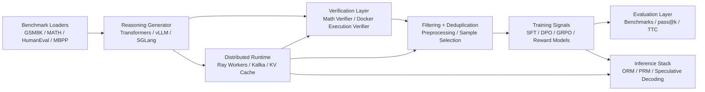
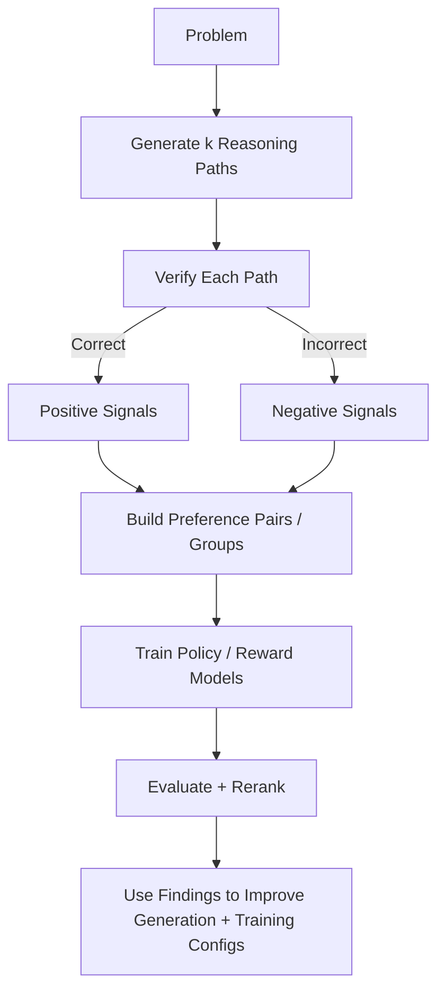
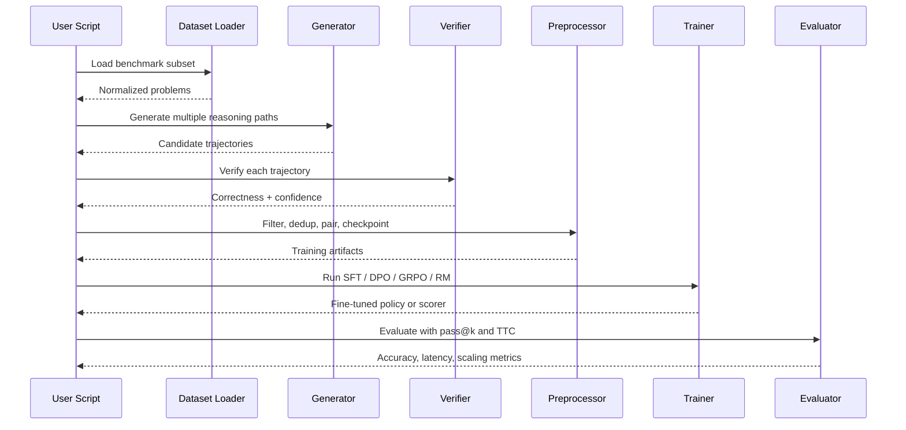

# Distributed Reasoning Loop

Author: **Dev Desai**

Distributed Reasoning Loop is a research engineering project that asks a practical question:

> Can we improve reasoning models by generating many candidate solutions, automatically verifying them, and feeding that signal back into training and inference?

This repository implements that loop end to end for verifiable reasoning domains such as grade-school math and code generation. It combines synthetic data generation, symbolic and execution-based verification, preference construction, reinforcement-learning-style fine-tuning, reward modeling, distributed orchestration, and test-time compute into one modular Python system.

The result is a codebase designed not just to train a model, but to study how correctness can become scalable supervision.

## Executive Summary

Large language models can produce convincing reasoning traces that are still wrong. My hypothesis for this project was that if I restrict the problem space to tasks with objective checkers, then I can turn correctness into a usable feedback signal across the full stack:

1. Generate many reasoning trajectories per prompt.
2. Verify them automatically with domain-specific checkers.
3. Filter, deduplicate, and structure them into training signals.
4. Improve the model with SFT, DPO, GRPO, and learned reward models.
5. Further improve answer quality at inference time through reranking and test-time compute.

This repository is the implementation of that hypothesis.

## Research Hypothesis

The central hypothesis behind this work is:

> In verifiable domains, objective correctness signals can substitute for a large fraction of expensive human preference labeling and still drive measurable gains in reasoning quality.

That breaks down into four smaller hypotheses:

1. **Verification can create scalable labels.**
   If a math expression can be checked symbolically or code can be executed in a sandbox, then each model sample becomes a labeled outcome.
2. **Contrasting correct and incorrect reasoning is useful for alignment.**
   Preference pairs and grouped outcomes should teach the model not just what the answer is, but what better reasoning looks like.
3. **Inference-time selection matters almost as much as training-time improvement.**
   A stronger generator is useful, but reranking and best-of-n search can unlock more value from the same base model.
4. **Systems design determines feasibility.**
   This loop only becomes practical if generation, verification, preprocessing, and evaluation can be parallelized and measured.

## What This Repository Does

This project is a full experimentation stack for verified reasoning, including:

- Multi-backend reasoning generation using `transformers`, `vLLM`, and `SGLang`
- Dataset normalization for `GSM8K`, `MATH`, `HumanEval`, and `MBPP`
- Symbolic math verification and Docker-isolated code execution verification
- Synthetic dataset construction for SFT, DPO, and GRPO workflows
- Learned outcome reward models and process reward models
- Test-time compute strategies such as best-of-n, majority vote, and reranking
- Optional Ray and Kafka components for scaling distributed stages
- Benchmarking and experiment scripts for throughput, pass@k, and training comparisons

## System Architecture



## Closed-Loop Learning Design



## Why This Project Is Interesting

Most reasoning repos focus on one slice of the stack: only inference, only RLHF, only evaluation, or only a dataset pipeline. I intentionally built this repository to cover the whole loop because the interesting behavior emerges from the interactions between components:

- A verifier is only useful if generation produces enough diversity.
- Preference optimization is only useful if preprocessing forms meaningful contrasts.
- Reward models are only useful if they can be compared against direct verification.
- Distributed infrastructure only matters if the experimentation loop is broad enough to become expensive.

This makes the repository both a modeling project and a systems project.

## Repository Structure

```text
.
├── config/
│   └── default.yaml
├── data/
│   ├── *.json / *.jsonl
│   └── checkpoints/
├── docker/
│   ├── Dockerfile.inference
│   ├── Dockerfile.worker
│   ├── Dockerfile.sandbox
│   ├── docker-compose.yml
│   └── docker-compose.dev.yml
├── scripts/
│   ├── generate_synthetic_data.py
│   ├── run_pipeline.py
│   ├── train_dpo.py
│   ├── evaluate.py
│   ├── eval_pass_at_k.py
│   ├── eval_finetuned.py
│   ├── compare_training_methods.py
│   ├── benchmark_throughput.py
│   ├── visualize_training.py
│   ├── eval_prm_vs_orm.py
│   └── run_ray_pipeline.py
├── src/
│   ├── data_generator/
│   ├── verifier/
│   ├── training/
│   ├── inference/
│   ├── orchestration/
│   └── evaluation/
├── tests/
├── main.py
├── METRICS.md
├── comparison_results.json
├── pass_at_k_results.json
├── throughput_results.json
├── requirements.txt
└── setup.py
```

## Core Components

### 1. Dataset and Problem Abstraction

`src/data_generator/dataset_loader.py` standardizes multiple datasets behind a common `Problem` representation. That matters because the rest of the pipeline can treat math and code tasks as uniformly as possible while still preserving domain-specific metadata such as `entry_point`, `test`, or reference answers.

Supported dataset entry points include:

- `GSM8K`
- `MATH`
- `HumanEval`
- `MBPP`

### 2. Multi-Backend Reasoning Generation

`src/data_generator/cot_generator.py` handles reasoning-path generation. The generator supports:

- `transformers` for straightforward local generation
- `vLLM` for efficient batched generation and serving
- `SGLang` for structured prompt execution and prefix-aware inference

Each problem can produce multiple candidate trajectories, which are wrapped with metadata and hashed so downstream filtering and deduplication can operate deterministically.

### 3. Verification Layer

The verification layer is the core differentiator of the project.

#### Math Verification

`src/verifier/math_verifier.py` extracts and normalizes final answers, then compares predicted and expected answers through exact, numeric, and symbolic equivalence logic. This allows the pipeline to score reasoning traces without requiring manual inspection.

#### Code Verification

`src/verifier/execution_verifier.py` and `src/verifier/code_verifier.py` execute generated code in Docker-isolated sandboxes with:

- no network access
- restricted memory
- limited CPU allocation
- read-only container execution
- capped process counts

This gives the project an objective way to score code-generation outputs while reducing the risk of executing arbitrary model-produced code on the host environment.

### 4. Synthetic Data Construction

`src/data_generator/synthetic_data_pipeline.py` turns raw model outputs into reusable training artifacts:

- `all_samples.jsonl`
- `filtered_samples.jsonl`
- `correct_samples.jsonl`
- `incorrect_samples.jsonl`
- `dpo_pairs.jsonl`
- `full_pairs.jsonl`
- `stats.json`

The preprocessing stage handles:

- answer extraction checks
- formatting cleanup
- repetitive-output filtering
- near-duplicate reduction
- diversity-aware positive/negative pairing

### 5. Training Stack

The repository supports multiple forms of post-training because different supervision structures answer different questions.

#### Supervised Fine-Tuning

`src/training/sft_trainer.py` trains on verified correct trajectories and acts as a clean warm-start baseline.

#### Direct Preference Optimization

`src/training/dpo_trainer.py` uses chosen/rejected pairs derived from verifier outcomes. This is the most direct way to test whether verified contrasts can stand in for manually labeled preference data.

#### Group Relative Policy Optimization

`src/training/grpo_trainer.py` groups outputs by prompt and optimizes relative advantages across correct and incorrect responses. The implementation includes:

- group-based reward assignment
- PPO-style clipping
- KL regularization against a reference model
- optional LoRA fine-tuning
- held-out verifier-backed evaluation
- offline-friendly W&B logging

#### Outcome Reward Model

`src/training/reward_model.py` trains a Bradley-Terry style reward model on prompt/chosen/rejected pairs. It assigns scalar preference scores to full trajectories and supports reranking during inference.

#### Process Reward Model

`src/training/process_reward_model.py` decomposes reasoning traces into steps, labels those steps, and learns a step-level scoring function. This enables reranking based on intermediate reasoning quality rather than only final outcomes.

### 6. Inference and Test-Time Compute

`src/evaluation/test_time_compute.py` provides the inference-time experimentation layer. Implemented strategies include:

- best-of-n sampling
- majority-vote self-consistency
- weighted selection
- beam-style search
- MCTS-style search
- outcome reward model reranking
- process reward model reranking

This is important because one of the central questions of the project is whether a better verifier-and-reranker stack can extract higher quality answers even before additional model training.

### 7. Distributed Systems Layer

The orchestration modules extend the project beyond a single-script prototype:

- `src/orchestration/ray_workers.py` distributes verification and tokenization work
- `src/orchestration/kafka_streaming.py` provides stage decoupling for pipeline events
- `src/orchestration/kv_cache_manager.py` captures prefix/cache-oriented serving concerns

This layer exists because reasoning loops become expensive quickly. Once every prompt produces many trajectories and every trajectory may be verified, filtered, tokenized, and reranked, the bottleneck stops being only model quality and becomes systems throughput.

## End-to-End Workflow



## Experimental Results

This repository already contains recorded experiment artifacts that show the loop is useful.

### Fine-Tuning Comparison

From `comparison_results.json`:

| Metric | Base Model | Fine-Tuned Model | Absolute Gain |
|---|---:|---:|---:|
| Pass@1 | 35.0% | 55.0% | +20.0 pts |
| Pass@4 | 65.0% | 75.0% | +10.0 pts |
| Pass@8 | 80.0% | 90.0% | +10.0 pts |
| Avg. reasoning steps | 14.79 | 17.03 | +2.24 |
| Inference time / problem | 7.65s | 8.70s | +1.05s |

Interpretation:

- The fine-tuned model improved single-shot success substantially.
- Gains remain visible at higher `k`, suggesting better candidate quality rather than only better selection.
- The fine-tuned model produces longer reasoning traces, which likely contributes to both higher quality and slightly higher latency.

### pass@k Scaling

From `pass_at_k_results.json`:

| k | Accuracy |
|---|---:|
| 1 | 35.0% |
| 4 | 65.0% |
| 8 | 70.0% |

This supports a second important conclusion: generation diversity plus selection already improves outcomes, even before deeper reranking or reward-model intervention.

### Throughput and Systems Findings

From `throughput_results.json`:

| Benchmark | Result |
|---|---|
| End-to-end pipeline throughput | 49.09 samples/sec |
| Prefix cache throughput | 49.5 samples/sec |
| No prefix cache throughput | 19.89 samples/sec |
| Verifier throughput | 35,526.13 samples/sec |

The most notable systems result is prefix reuse:

- With prefix cache: `49.5 samples/sec`
- Without prefix cache: `19.89 samples/sec`

That is roughly a **2.5x throughput improvement**, which validates the decision to include serving-oriented infrastructure instead of treating generation as a black box.

### Ray Scaling Snapshot

Also from `throughput_results.json`:

| Workers | Throughput | Speedup | Efficiency |
|---|---:|---:|---:|
| 1 | 5.00 | 1.00x | 100.0% |
| 2 | 9.01 | 1.80x | 90.1% |
| 4 | 16.25 | 3.25x | 81.2% |

This is the kind of scaling behavior I hoped to see: sublinear but still strong returns as verification and preprocessing are distributed.

## What These Results Mean

Taken together, the recorded artifacts suggest three things:

1. **Verified synthetic supervision is viable.**
   The move from `35%` to `55%` pass@1 is large enough to be meaningful at the scale shown here.
2. **Inference-time compute matters.**
   The jump from pass@1 to pass@4 indicates that candidate generation plus selection is already a strong lever.
3. **Systems choices materially affect experimentation velocity.**
   Prefix caching and Ray-based parallelism change how practical the loop is to run.

## Design Decisions

### Why verifiable domains?

Because verification gives objective labels. In domains like math and code, I can cheaply distinguish useful and non-useful reasoning traces at scale.

### Why both training-time and inference-time methods?

Because they answer different questions:

- training improves the policy itself
- inference-time compute improves selection over samples
- reward models help bridge the two

Keeping them in one codebase allows apples-to-apples comparisons.

### Why include Ray, Kafka, and serving abstractions?

Because realistic reasoning loops are pipeline problems, not only modeling problems. Once the number of samples per prompt increases, orchestration, batching, and checkpointing become first-order concerns.

## How To Run

### Installation

```bash
python -m venv .venv
source .venv/bin/activate
pip install -r requirements.txt
pip install -e .
```

Optional extras:

```bash
pip install -e .[inference]
pip install -e .[distributed]
pip install -e .[training]
pip install -e .[dev]
```

### Main entrypoint

```bash
python main.py --help
```

### Generate synthetic data

```bash
python main.py generate --dataset gsm8k --num-paths 10
```

### Train with DPO

```bash
python main.py train --data-path ./synthetic_data/dpo_pairs.jsonl
```

### Train with GRPO

```bash
python main.py train-grpo --data-path ./synthetic_data/full_pairs.jsonl --epochs 1
```

Use `--num-gpus auto` (default) to automatically use all visible GPUs, or set
an explicit value such as `--num-gpus 2`.

### Evaluate a model

```bash
python main.py evaluate --model ./grpo_output --benchmark gsm8k
```

For honest multi-sample evaluation, add `--use-ttc`. The default TTC path now
uses consensus-style answer aggregation without looking at the ground-truth
answer. If you explicitly want oracle verifier reranking for analysis, pass
`--ttc-oracle-verify` and treat that result as diagnostic rather than a
benchmark number.

### Run the full pipeline

```bash
python main.py pipeline --dataset gsm8k --subset-size 100 --training-method best
```

`best` runs the strongest built-in training path:

1. SFT on verifier-approved correct traces
2. DPO on preference pairs
3. GRPO online refinement from the DPO checkpoint

### Launch serving

```bash
python main.py serve --model Qwen/Qwen2.5-7B-Instruct --port 8000
```

## Configuration

The default configuration lives in `config/default.yaml` and covers:

- generation models and sampling behavior
- dataset selection
- verifier type and sandbox limits
- Ray and Kafka orchestration settings
- DPO, GRPO, reward-model, and PRM settings
- evaluation and reranking paths
- W&B offline logging

Kafka streaming is integrated into the data-generation stage through
`scripts/run_pipeline.py` and is controlled by
`orchestration.kafka.enabled` (default `false`).

This makes the project easy to repurpose as either:

- a local experimentation repo
- a distributed research prototype
- or a portfolio-quality example of end-to-end reasoning infrastructure

## Safety and Verification Philosophy

A key design principle in this repository is that reasoning quality should be judged by outcomes whenever possible. For code tasks, that means sandboxed execution rather than string matching. For math tasks, that means normalized symbolic or numeric equivalence rather than superficial formatting checks.

This matters because reasoning models are especially good at producing outputs that look persuasive while hiding mistakes. Verifiers help turn that ambiguity into measurable signals.

## Limitations

This project is intentionally ambitious, and the current repository still has natural limitations:

- benchmark sizes in the included artifacts are modest
- performance claims are strongest in verifiable domains, not open-ended reasoning
- some orchestration paths are optional and disabled by default (for example Kafka streaming)
- reward models and PRMs depend on the quality of generated preference data
- code verification assumes a working Docker-based sandbox environment

These limitations do not weaken the core contribution; they define the next set of experiments.

## Future Work

The most compelling next steps would be:

1. Expand evaluation on larger held-out benchmark slices.
2. Compare verifier-only reranking against learned reward reranking more systematically.
3. Measure cost-quality tradeoffs across `transformers`, `vLLM`, and `SGLang`.
4. Extend the loop to harder symbolic domains and tool-using tasks.
5. Add richer observability around error modes, verifier disagreements, and reward calibration.

## Why This Project Matters

I built this repository to demonstrate more than model fine-tuning. It shows how I think about machine learning systems end to end:

- define a concrete hypothesis
- build the infrastructure needed to test it
- create objective measurement paths
- connect training and inference instead of treating them separately
- and make the whole loop reproducible enough to iterate on

For research engineering, that combination matters. Good ideas are only valuable when they can be operationalized, measured, and improved.

## Contact / Attribution

This repository was created and authored by **Dev Desai** as a research-engineering project exploring scalable supervision for reasoning models.
