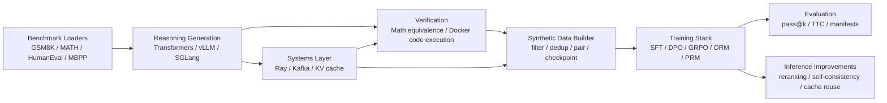
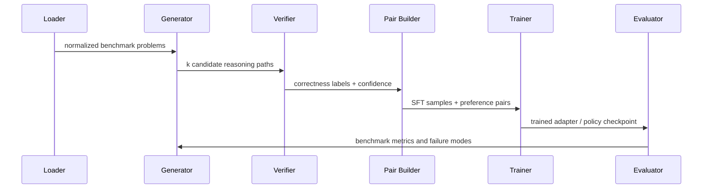

# Distributed Reasoning Loop

**Author:** Dev Desai  
**Focus:** verifiable reasoning, synthetic supervision, post-training, test-time compute, and distributed ML systems

Distributed Reasoning Loop is an end-to-end research engineering system for improving reasoning models with objective feedback. It generates multiple candidate solutions, verifies them with math or code checkers, converts correctness into training data, fine-tunes the policy, and evaluates the result with benchmark and systems metrics.

The project is built around a simple thesis:

> In domains where answers can be checked automatically, correctness can become scalable supervision.

## Results Snapshot

| Benchmark | Task Type | Result |
|---|---|---:|
| GSM8K | grade-school math | **71.0% accuracy** |
| MATH | competition math | **36.0% accuracy** |
| HumanEval | code generation | **42.0% pass@1** |
| MBPP | Python programming problems | **57.0% pass@1** |
| GSM8K pass@k | math reasoning with multiple samples | **35.0% pass@1 -> 70.0% pass@8** |
| GSM8K fine-tuning comparison (N=20 held-out) | base vs GRPO-tuned model | **+20.0 pass@1 points** |

### Fine-Tuning Lift

From `comparison_results.json` on a **20-problem held-out GSM8K slice**. The slice
size is small on purpose: it is the local-machine receipt the comparison file
ships with, not a benchmark-grade evaluation. Treat it as a directional signal
that the GRPO loop moved pass@1 upward on this slice, not as a generalization
claim. Scaling to a larger slice is tracked in the roadmap.

| Metric | Base Qwen2.5-1.5B-Instruct | Fine-Tuned `./outputs/grpo_model` | Gain |
|---|---:|---:|---:|
| Pass@1 (N=20) | 35.0% | **55.0%** | **+20.0 pts** |
| Pass@4 (N=20) | 65.0% | **75.0%** | **+10.0 pts** |
| Pass@8 (N=20) | 80.0% | **90.0%** | **+10.0 pts** |
| Correct@1 | 7 / 20 | **11 / 20** | +4 |

### Systems Benchmarks

From `throughput_results.json`:

| System Metric | Result |
|---|---:|
| End-to-end pipeline throughput | **49.09 samples/sec** |
| Prefix-cache throughput | **49.50 samples/sec** |
| No-prefix-cache throughput | 19.89 samples/sec |
| Prefix-cache speedup | **~2.5x** |
| Math verifier throughput | **35,526 verifications/sec** |
| Ray **verification** scaling, 4 workers | **3.25x speedup**, 81.2% efficiency |

The 3.25x / 81.2% number is **verification-stage** Ray scaling (parallel math
checking inside `RayMathVerificationPool`). It is not a training-stage number
and should not be quoted as one. The training-side distributed receipt is
tracked separately in `outputs/distributed_run/TRAINING_RECEIPT.md` and is
explicitly awaiting multi-GPU hardware.

## What It Does

Most reasoning projects focus on one layer: prompting, fine-tuning, evaluation, or infrastructure. This repository connects the full loop:

1. Load benchmark problems from GSM8K, MATH, HumanEval, or MBPP.
2. Generate multiple reasoning paths with `transformers`, `vLLM`, or `SGLang`.
3. Verify outputs with symbolic math checks or Docker-isolated code execution.
4. Build synthetic artifacts such as `correct_samples.jsonl` and `dpo_pairs.jsonl`.
5. Train with SFT, DPO, GRPO, outcome reward models, or process reward models.
6. Evaluate with pass@k, consensus-style test-time compute, and benchmark manifests.
7. Scale expensive stages with optional Ray workers, Kafka streaming, and prefix caching.

## Architecture



The core design is deliberately modular: generation, verification, training, and evaluation can be run independently, but the strongest path is the closed loop.



## Core Components

### Dataset Layer

`src/data_generator/dataset_loader.py` normalizes benchmark examples into a common problem interface. Supported sources include:

- `GSM8KLoader`
- `MATHLoader`
- `HumanEvalLoader`
- `MBPPLoader`

This lets math and code tasks share the same generation/training pipeline while preserving domain-specific metadata such as expected answers, tests, and entry points.

### Generation Layer

`src/data_generator/cot_generator.py` produces multiple candidate trajectories per prompt. It supports:

- Hugging Face `transformers` for local generation
- `vLLM` for high-throughput batched generation
- `SGLang` for structured generation and prefix-aware inference

Each sample is stored with problem metadata, final-answer extraction, correctness status, and stable hashes for reproducible deduplication.

### Verification Layer

Verification is the main differentiator.

- `src/verifier/math_verifier.py` checks numeric and symbolic equivalence for math answers.
- `src/verifier/execution_verifier.py` and `src/verifier/code_verifier.py` execute generated code in constrained Docker sandboxes.
- GSM8K and HumanEval have specialized verifier paths for their answer/test formats.

This turns model outputs into objective labels instead of relying on manual preference annotation.

### Synthetic Data Builder

`src/data_generator/synthetic_data_pipeline.py` converts raw generations into reusable artifacts:

- `all_samples.jsonl`
- `filtered_samples.jsonl`
- `correct_samples.jsonl`
- `incorrect_samples.jsonl`
- `dpo_pairs.jsonl` (legacy flat schema)
- `dpo_pairs_v1.jsonl` (provenance-tagged v1 envelope)
- `full_pairs.jsonl`
- `stats.json`

The preprocessing step filters repetitive traces, removes near duplicates, prioritizes high-confidence positives, and builds diverse correct/incorrect preference pairs.

#### v1 Provenance Schema

Every pair emitted by the v1 path carries a `provenance` block and a `quality_score`. The on-disk JSONL envelope is:

```json
{
  "pair": {"problem_id": "...", "problem": "...", "prompt": "...", "chosen": "...", "rejected": "...", "expected_answer": "..."},
  "provenance": {
    "pair_id": "sha256(problem_id|chosen|rejected)",
    "problem_id": "gsm8k_train_0123",
    "source_dataset": "gsm8k",
    "source_split": "train",
    "generator_backend": "vllm",
    "generator_model": "Qwen/Qwen2.5-1.5B-Instruct",
    "generation_temperature": 0.7,
    "generation_seed": 42,
    "verifier_verdict_chosen": "accept",
    "verifier_verdict_rejected": "reject",
    "verifier_version": "v1",
    "dedup_hash_chosen": "...",
    "dedup_hash_rejected": "...",
    "quality_score": 0.83,
    "generated_at": "2026-06-12T...",
    "schema_version": "1"
  },
  "quality_score": 0.83
}
```

The quality score is the mean of three [0, 1] components: verifier verdict (1.0 / 0.0), inline `<<a op b = c>>` step coherence, and a length penalty against the running median trace length. See `src/data_generator/quality_score.py`.

#### Generating at Scale

```bash
# v1 emission path (default), with checkpoint shards under outputs/synthetic_data/checkpoints/
python main.py generate --dataset gsm8k --num-paths 12 \
    --target-pairs 30000 --max-pairs-per-problem 8 \
    --with-provenance --resume
```

- `--target-pairs N` — stop emitting once N unique pairs have been written.
- `--max-pairs-per-problem K` — cap combinatorial pair-count per problem.
- `--resume` — pick up from the latest checkpoint shard. The seen-set is rebuilt from disk so dedup stays correct across restarts.
- `--no-provenance` — opt back into the legacy emission path.

#### Migrating Legacy Pairs

To rewrite an existing `data/dpo_pairs.jsonl` into the v1 envelope:

```bash
python scripts/migrate_pairs_to_v1.py data/dpo_pairs.jsonl
```

The helper is idempotent: re-running on a v1 file is a no-op, and a `.bak` copy of the original is created the first time. Legacy lines come back with `generator_backend: "legacy"` and `quality_score: null` because the original verdicts are not recoverable.

A small CPU-only smoke artifact set lives under `samples/synthetic_smoke/` for exercising the envelope without invoking the LLM.

### Training Stack

The training code lives in `src/training/`.

| Method | Purpose |
|---|---|
| SFT | Warm-start on verified correct reasoning traces |
| DPO | Learn from verifier-derived chosen/rejected pairs |
| GRPO | Optimize grouped candidate outcomes with relative rewards |
| Outcome Reward Model | Score full responses for reranking |
| Process Reward Model | Score intermediate reasoning steps |

The strongest built-in pipeline is:

```text
SFT on correct traces -> DPO on preference pairs -> GRPO refinement -> benchmark evaluation
```

Recent Kaggle/T4 support includes explicit `4bit` quantized LoRA loading and CUDA memory guards so the full `best` pipeline can run without skipping SFT.

### Evaluation and Test-Time Compute

`src/evaluation/` implements:

- GSM8K, MATH, and HumanEval evaluators
- pass@k evaluation
- majority vote and consensus-style selection
- best-of-n sampling
- optional reward-model reranking
- run manifests with git commit, branch, model path, validity status, and error counts

The project treats benchmark health seriously: `valid_run: true` means the run completed with `errors == 0`; partial or failed runs are not quoted as scores.

#### Running real receipts

`notebooks/kaggle_receipts.ipynb` drives the synthetic / agreement /
robustness pipelines end-to-end on a single Kaggle T4 and emits three
versioned JSONs:

- `receipts/synthetic_v1.json` — synthetic-data scale-up stats (target
  30k unique DPO pairs)
- `receipts/agreement_v1.json` — three-way verifier / RM / judge
  agreement on 200 GSM8K problems x 4 samples
- `receipts/robustness_v1.json` — perturbation retention across six
  perturbations on the same 200 x 4 slice

Hardware: Kaggle free-tier T4 (16 GB) is sufficient. Expected
wall-clock is roughly 4-6 hours; each cell writes its receipt as soon
as it finishes, so an interrupted session keeps whatever has already
completed.

The notebook itself is rendered from `scripts/build_kaggle_notebook.py`
so review diffs are readable. To regenerate it after editing the
source script:

```bash
python scripts/build_kaggle_notebook.py
```

For CPU-only validation (no GPU, no network, no model weights) the
same orchestration is exercised by:

```bash
python scripts/collect_receipts.py --mode smoke --stage all \
    --output-dir /tmp/receipts_smoke
```

This produces the three receipts under `/tmp/receipts_smoke/receipts/`
in under 10 seconds using stub generators and a rule-based stub judge.
It is what runs in the test suite and what guards the schemas from
silent drift.

Until the real run lands, any numbers tagged N=200 in this README are
placeholders awaiting Phase R2 hardware execution.

### Distributed Systems Layer

`src/orchestration/` includes:

- Ray workers for verification and tokenization parallelism
- Kafka streaming hooks for decoupled pipeline stages
- KV-cache management for serving-oriented inference experiments
- A scaling-efficiency utility (`scaling.py`) used by the training launcher

This matters because verified reasoning gets expensive quickly: every prompt may create many candidate paths, and every path needs verification, filtering, and possibly training-time reuse.

### Distributed Training

`scripts/launch_distributed.py` is a torchrun-compatible launcher for the
SFT -> DPO -> GRPO stack. The same script runs single-GPU and multi-GPU with
no code change; the trainers detect `WORLD_SIZE > 1` from the torchrun env
and wrap themselves in `DistributedDataParallel`.

```bash
torchrun --nproc-per-node=$NGPUS scripts/launch_distributed.py \
    --stage all \
    --dataset gsm8k \
    --model Qwen/Qwen2.5-1.5B-Instruct \
    --output-dir ./outputs/distributed_run \
    --log-dir ./logs/distributed_run
```

Backends:

- **NCCL** on CUDA hosts (the production path).
- **Gloo** when CUDA is unavailable (the CPU smoke path so the harness is
  exercisable on machines without a GPU).

Outputs per run:

- `<log-dir>/rank_*.log` — per-rank init / heartbeat traces. Useful for
  confirming every rank joined the process group.
- `<log-dir>/training_steps.jsonl` — per-step metrics emitted from rank 0
  (`step`, `loss`, `lr`, `tokens_per_sec`, `samples_per_sec`, `wall_clock_s`).
- `<output-dir>/scaling_summary.json` — aggregated throughput per stage,
  and when `--single-gpu-throughput` is supplied, speedup and efficiency.

**Status.** The launcher, the DDP-wrapped trainers (SFT/DPO via HF Trainer's
DDP integration, GRPO via the custom `DDP(...)` wrapper in
`grpo_trainer.py`), the scaling utility, the seed-replicated eval driver
(`scripts/eval_replicated.py`), and a CPU smoke artifact
(`samples/distributed_smoke/`) are all in this repo and run today. The
multi-GPU training receipt itself
(`outputs/distributed_run/TRAINING_RECEIPT.md`) is **awaiting hardware** —
the environment this commit was produced in does not have multi-GPU access,
and quoting a multi-GPU receipt without running it would be dishonest.

To produce the receipt, run the launcher under torchrun on a 2-GPU or 4-GPU
host (Kaggle 2xT4, Colab Pro+, or a lab cluster), then run
`scripts/eval_replicated.py` against the resulting checkpoint and fill in the
template. No code changes are required.

## Repository Map

```text
.
├── config/                  # Model, training, verifier, and orchestration config
├── docs/                    # Kaggle and workflow notes
├── scripts/                 # Pipeline, evaluation, training, and benchmark CLIs
├── src/
│   ├── data_generator/      # Dataset loaders and synthetic data pipeline
│   ├── evaluation/          # Benchmark and test-time-compute logic
│   ├── inference/           # vLLM, SGLang, speculative decoding
│   ├── orchestration/       # Ray, Kafka, KV-cache utilities
│   ├── training/            # SFT, DPO, GRPO, ORM, PRM
│   └── verifier/            # Math and code correctness checkers
├── tests/                   # Unit and integration coverage
├── METRICS.md               # Valid benchmark checkpoint tracking
├── comparison_results.json  # Base vs fine-tuned comparison
├── pass_at_k_results.json   # pass@k artifact
└── throughput_results.json  # Systems benchmark artifact
```

## How To Run

Install:

```bash
python -m venv .venv
source .venv/bin/activate
pip install -r requirements.txt
pip install -e .
```

Generate synthetic data:

```bash
python main.py generate \
  --dataset gsm8k \
  --num-paths 8 \
  --subset-size 600 \
  --backend vllm \
  --output-dir ./outputs/synthetic_data
```

Run the full training loop:

```bash
python main.py pipeline \
  --dataset gsm8k \
  --subset-size 600 \
  --training-method best
```

Evaluate:

```bash
python main.py evaluate \
  --model ./outputs/grpo_model \
  --benchmark gsm8k \
  --fail-on-errors
```

Use test-time compute:

```bash
python main.py evaluate \
  --model ./outputs/grpo_model \
  --benchmark gsm8k \
  --use-ttc \
  --ttc-samples 16 \
  --fail-on-errors
```

### Three-way agreement

`python main.py eval agreement ...` runs the same set of traces through the
math/code verifier, the learned reward model, and an open-weights LLM judge
(default Qwen2.5-7B-Instruct), then writes Cohen's kappa with 95% bootstrap
CIs, confusion matrices per pair, and a shortcut bucket of verifier-accepted
traces the judge flagged as bad reasoning. The same pipeline supports three
benchmarks; the verifier and difficulty binner swap per benchmark, the judge
rubric switches between `MATH_RUBRIC_V1` and `CODE_RUBRIC_V1`:

| Benchmark | Verifier | Difficulty bins | Rubric |
|---|---|---|---|
| `gsm8k` | numeric equivalence | `low` / `mid` / `high` from `<<step>>` count | `MATH_RUBRIC_V1` |
| `math` | symbolic equivalence | `level_1` ... `level_5` from MATH `level` field | `MATH_RUBRIC_V1` |
| `humaneval` | sandbox execution (Docker) with subprocess fallback | uniform single bucket (`all`) | `CODE_RUBRIC_V1` |

```bash
python main.py eval agreement \
  --model ./outputs/grpo_model \
  --benchmark gsm8k \
  --n-problems 100 \
  --n-samples 4 \
  --judge-model Qwen/Qwen2.5-7B-Instruct \
  --reward-model ./outputs/reward_model \
  --output-dir ./outputs/agreement_run

# MATH — symbolic equivalence path
python main.py eval agreement --benchmark math \
  --model ./outputs/grpo_model \
  --n-problems 100 --n-samples 2 \
  --output-dir ./outputs/agreement_math

# HumanEval — code-execution path
python main.py eval agreement --benchmark humaneval \
  --model ./outputs/grpo_model \
  --n-problems 100 --n-samples 4 \
  --output-dir ./outputs/agreement_humaneval
```

The HumanEval path prefers the Docker-backed sandbox when the
`distributed-reasoning-loop-sandbox` image is available locally; if it
isn't, the runner falls back to a subprocess-based code executor so the
CPU smoke (and CI) work without Docker.

Once a Kaggle run lands, `scripts/agreement_compare.py` joins ≥2 receipts
into `eval_receipts/agreement_cross_benchmark.md`, a single side-by-side
table of judge reliability per benchmark. That table is the headline
artifact for this subsection in the next numbers PR.

A pipeline-smoke artifact (`samples/agreement_smoke/agreement_smoke.json`,
produced by `scripts/agreement_smoke.py`) shows the format. It is **not** a
benchmark claim — it runs against five synthetic problems with a rule-based
fake judge so the harness works on machines with no GPU and no network.

### Robustness (perturbation retention)

`python main.py eval robust ...` measures how pass@1 holds up under six
deterministic GSM8K perturbations:

| Perturbation | Label | What it does |
|---|---|---|
| number_swap | rewrites gold | Swap one operand in the final multiplicative step; scale gold accordingly |
| unit_change | rewrites gold | Rewrite a recognised unit (dollars↔cents, hours↔minutes, kg↔g); scale gold |
| irrelevant_context | preserves | Prepend an unrelated sentence |
| distractor_sentence | preserves | Insert a sentence with a plausible-looking but irrelevant number |
| paraphrase | preserves | Rule-based clause/word rewrites (no LLM) |
| reordering | preserves | Swap the first two sentences when there is no anaphora |

For each perturbation the runner reports applicability rate, per-perturbation
pass@1 retention with a 95% bootstrap CI on the same subset of problems
(controlling for difficulty), and an overall robustness score equal to the
geometric mean of per-perturbation retentions.

```bash
python main.py eval robust \
  --model ./outputs/grpo_model \
  --benchmark gsm8k \
  --n-problems 200 \
  --n-samples 4 \
  --seed 0 \
  --output-dir ./outputs/robustness_run
```

A pipeline-smoke artifact (`samples/robustness_smoke/`, produced by
`scripts/robustness_smoke.py`) exercises the same path with hand-written
predictions against six inline problems. It is **not** a benchmark claim.

Run on Kaggle T4:

- Use `drlll2_training_ready.ipynb`.
- Keep `--training-method best`.
- Do not add `--skip-sft`.
- Put precomputed synthetic data at `outputs/synthetic_data/dpo_pairs.jsonl` and `outputs/synthetic_data/correct_samples.jsonl` if reusing a previous generation run.

## Why This Is Portfolio-Relevant

This project demonstrates more than model fine-tuning. It shows the ability to build an ML system across the full research-to-infrastructure stack:

- objective verification instead of subjective labeling
- synthetic data construction with quality filters
- multiple post-training algorithms
- benchmark validity checks and reproducibility manifests
- GPU-aware training paths for constrained runtimes
- distributed pipeline components for scale
- honest measurement of both model quality and systems throughput

The result is a project that a reviewer can understand as a complete engineering system, not just a notebook experiment.

## Roadmap

1. Scale all four benchmark runs to larger held-out slices.
2. Compare verifier reranking, outcome reward reranking, and process reward reranking on the same evaluation sets.
3. Add richer error taxonomy dashboards for failed reasoning paths.
4. Expand Kaggle and local reproducibility docs with cost/runtime estimates.
5. Extend the loop to harder symbolic, tool-use, and multi-step coding tasks.

## Attribution

Created by **Dev Desai** as a research-engineering project on scalable supervision for reasoning models.
