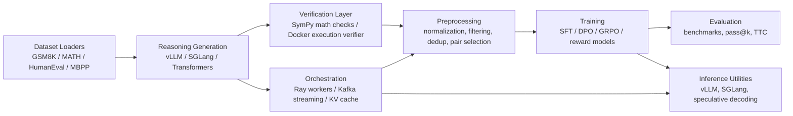

# Distributed Reasoning Loop

Created and maintained by `DevDesai-444`.

I built Distributed Reasoning Loop as a research engineering project around one idea:

> if a task can be verified automatically, I can use that verifier to create training signals for reasoning models at scale.

This repository combines synthetic chain-of-thought generation, answer checking, preference construction, RL-style fine-tuning, distributed processing, inference optimization, and benchmark evaluation in one modular Python codebase.

## What This Project Is

Distributed Reasoning Loop is not a single API service or one narrow training script. It is a full experimentation stack for verifiable reasoning tasks such as math and code.

At a high level, the loop is:

1. Load a benchmark problem.
2. Generate multiple reasoning paths with a teacher or serving backend.
3. Verify which paths are correct.
4. Filter and deduplicate the results.
5. Convert verified outcomes into DPO pairs or GRPO groups.
6. Fine-tune a reasoning model.
7. Evaluate the model with standard benchmarks and test-time compute methods.

The repository is designed to answer three research questions:

- Can correctness act as scalable supervision for reasoning?
- Can I turn verified generations into useful DPO or GRPO training data?
- Can better inference systems and distributed orchestration make this loop practical?

## Core Thesis

Most of the repository exists to support a single training philosophy:

- generate many candidate solutions,
- check them with objective verifiers,
- keep the good ones,
- contrast them against bad ones,
- and train the model on that signal.

That is why the project is centered on verifiable domains:

- `gsm8k` and `math` for symbolic or numeric checking,
- `humaneval` for execution-based code verification,
- and partially `mbpp` as an additional code dataset entry point.

## Architecture



## Why Each Major Piece Exists

| Component | How it is used in this repo | Why it is used |
|---|---|---|
| `torch` + `transformers` | model loading, tokenization, generation, custom training loops | this is the base LLM runtime for almost everything |
| `vLLM` | batched reasoning generation and OpenAI-compatible serving | efficient multi-sample generation for synthetic data and inference |
| `SGLang` | reasoning generation, batched prompt execution, prefix-aware inference | useful for repeated prompt structures and RadixAttention-style reuse |
| `Ray` | distributed verification, tokenization, and batch preparation workers | parallelizes expensive preprocessing and verification stages |
| `Kafka` | optional streaming abstraction between pipeline stages | decouples generation, verification, and training data flow |
| `SymPy` | math answer extraction and symbolic or numeric equivalence checks | gives objective supervision for math tasks |
| `Docker` | sandboxed code execution for generated programs | isolates execution-verifier runs for untrusted code completions |
| `TRL` | DPO and SFT trainer wrappers | speeds up preference-learning experiments |
| `PEFT` / LoRA | parameter-efficient fine-tuning in DPO, GRPO, and SFT trainers | lowers memory cost and makes experiments more practical |
| `datasets` | benchmark loading from Hugging Face | standardizes problem ingestion for GSM8K, HumanEval, MBPP, and MATH |
| `OmegaConf` / `hydra-core` | configuration loading | keeps phase-level settings centralized |
| `Weights & Biases` | optional offline-first experiment logging | captures GRPO curves, verifier metrics, and reward-margin histograms |
| `pytest` | unit and integration-style tests | validates core data structures and verifier behavior |

## Repository Layout

```text
.
├── config/
│   └── default.yaml              default settings for generation, verifier selection, training, and inference
├── data/
│   ├── *.jsonl / *.json          bundled sample outputs from prior runs
│   └── checkpoints/              intermediate pipeline checkpoints
├── docker/
│   ├── Dockerfile.inference      GPU-oriented vLLM inference image
│   ├── Dockerfile.worker         Ray worker image
│   ├── Dockerfile.sandbox        secure code-execution sandbox
│   ├── docker-compose.yml        full multi-service deployment
│   └── docker-compose.dev.yml    lighter local development stack
├── scripts/
│   ├── generate_synthetic_data.py
│   ├── train_dpo.py
│   ├── run_pipeline.py
│   ├── evaluate.py
│   ├── run_ray_pipeline.py
│   ├── eval_pass_at_k.py
│   ├── eval_finetuned.py
│   ├── compare_training_methods.py
│   ├── benchmark_throughput.py
│   └── visualize_training.py
├── src/
│   ├── data_generator/           dataset loading, prompting, generation, preprocessing, pipeline assembly
│   ├── verifier/                 math, execution, and step-level verification utilities
│   ├── training/                 DPO, GRPO, SFT, outcome reward models, process reward models
│   ├── inference/                vLLM, SGLang, speculative decoding
│   ├── orchestration/            Ray workers, Kafka adapters, KV-cache managers
│   └── evaluation/               benchmark runners and test-time compute
├── tests/                        unit tests for core data and verifier logic
├── main.py                       convenience CLI entrypoint
├── setup.py                      package metadata and extras
├── requirements.txt              base dependency list
└── METRICS.md                    recorded experiment snapshot
```

## The Main End-to-End Workflow

### 1. Load benchmark problems

`src/data_generator/dataset_loader.py` provides a common `Problem` abstraction and loader classes for:

- `GSM8KLoader`
- `HumanEvalLoader`
- `MBPPLoader`
- `MATHLoader`

This matters because the rest of the system can operate on one normalized problem shape instead of special-casing every dataset downstream.

### 2. Generate multiple reasoning paths

`src/data_generator/cot_generator.py` is the generation layer.

It supports three backends:

- `vllm` for high-throughput local generation,
- `sglang` for server-based reasoning generation and prefix reuse,
- `transformers` as a fallback path.

The generator builds chat-style prompts for math and code separately, samples multiple reasoning paths per problem, and wraps them in a `ReasoningPath` object with metadata and a stable hash.

### 3. Verify the outputs

The verifier layer is what makes the project different from a generic synthetic-data pipeline.

`src/verifier/math_verifier.py`

- extracts final answers from model output,
- normalizes formatting,
- compares answers by exact match, numeric equivalence, or symbolic equivalence,
- and specializes GSM8K checking through `GSM8KVerifier`.

`src/verifier/execution_verifier.py`

- runs Python code plus injected tests in a Docker-isolated subprocess,
- returns `PASS`, `FAIL`, `TIMEOUT`, or `COMPILE_ERROR`,
- assigns partial penalties for timeout and compile failures,
- supports thread-pooled batch verification,
- and logs latency plus error distributions to W&B when enabled.

`src/verifier/code_verifier.py`

- extracts code blocks,
- runs code inside Docker sandboxes,
- supports multiple languages in the sandbox abstraction,
- and provides `HumanEvalVerifier` for execution-based correctness checks.

`src/verifier/step_extractor.py`

- splits long-form reasoning into newline-level steps,
- filters out short fragments,
- and supports process reward model supervision and reranking.

This stage turns raw generations into binary or scalar supervision signals with confidence and latency metadata.

### 4. Preprocess and build preference data

`src/data_generator/data_preprocessor.py` handles:

- normalization,
- answer-presence checks,
- rough reasoning-quality checks,
- repetitive-output filtering,
- near-duplicate removal,
- and smart DPO pair creation.

`src/data_generator/synthetic_data_pipeline.py` ties generation, verification, checkpointing, preprocessing, and final artifact writing together. Its outputs include:

- `all_samples.jsonl`
- `filtered_samples.jsonl`
- `correct_samples.jsonl`
- `incorrect_samples.jsonl`
- `dpo_pairs.jsonl`
- `full_pairs.jsonl`
- `stats.json`

### 5. Train the model

Training is split into separate modules because each method expects different supervision shapes.

`src/training/dpo_trainer.py`

- consumes prompt / chosen / rejected preference pairs,
- optionally uses LoRA,
- and wraps TRL's DPO trainer for preference optimization.

`src/training/grpo_trainer.py`

- groups correct and incorrect responses by prompt,
- computes normalized group-relative advantages,
- applies a PPO-style clipped objective with a KL term,
- logs KL divergence, mean reward, reward spread, and held-out pass@1 checkpoints,
- and can instantiate either a math verifier or the execution verifier from config.

`src/training/sft_trainer.py`

- trains on verified correct paths only,
- and acts as an optional warm-start stage before preference optimization.

`src/training/reward_model.py`

- implements a learned Bradley-Terry outcome reward model,
- trains directly from prompt / chosen / rejected JSONL pairs,
- logs reward-margin histograms after each epoch,
- and saves checkpoints under `outputs/reward_model/`.

`src/training/process_reward_model.py`

- builds step-level supervision from reasoning traces,
- writes labeled steps to `synthetic_data/step_labels.jsonl`,
- trains a process reward model on diverging steps,
- and reranks candidate solutions by mean step reward.

### 6. Evaluate the trained system

`src/evaluation/benchmarks.py` provides benchmark evaluators for:

- GSM8K,
- HumanEval,
- MATH.

`src/evaluation/test_time_compute.py` adds inference-time search and selection methods such as:

- best-of-n,
- majority-vote self-consistency,
- beam search,
- MCTS-style reasoning search.

It now also supports:

- outcome reward model reranking,
- process reward model reranking,
- and direct PRM-vs-ORM comparisons over the same candidate set.

The design choice here is intentional: I wanted training-time improvements and inference-time scaling to live in the same repo so they could be compared directly.

## Distributed and Systems Layer

This project is not only about model training. It also explores the systems side of reasoning pipelines.

### Ray

`src/orchestration/ray_workers.py` contains:

- verification workers,
- tokenization workers,
- batch preparation workers,
- a `DistributedDataProcessor`,
- and a Kafka-to-Ray bridge.

This lets the expensive middle of the pipeline scale beyond a single Python process.

### Kafka

`src/orchestration/kafka_streaming.py` defines:

- producer and consumer wrappers,
- stage-specific reasoning data producers and consumers,
- topic setup utilities.

Kafka is optional here. It is present for decoupled streaming workflows, not because the default local pipeline requires it.

### KV cache and prefix reuse

`src/orchestration/kv_cache_manager.py` implements:

- a local LRU-style KV cache,
- a radix-tree cache for prefix matching,
- a Ray-backed distributed KV cache abstraction.

This exists because repeated reasoning prompts share long prefixes, and cached prefixes can materially improve throughput in multi-sample generation.

## Inference Utilities

`src/inference/vllm_engine.py`

- wraps vLLM generation,
- supports logprobs and batched chain-of-thought sampling.

`src/inference/sglang_engine.py`

- wraps SGLang programs,
- supports multi-path reasoning generation and multi-turn refinement.

`src/inference/speculative_decoding.py`

- implements draft/target speculative decoding,
- tracks acceptance statistics,
- and includes a tree-based speculative variant.

These modules are more experimental than the core synthetic-data pipeline, but they show the repo is thinking about both model quality and serving efficiency.

## Scripts and Execution Modes

The scripts folder exposes the repo in several different ways:

- `python main.py generate ...` for synthetic data generation
- `python main.py train ...` for DPO training
- `python main.py train-grpo ...` for GRPO training
- `python main.py evaluate ...` for benchmark evaluation
- `python main.py pipeline ...` for the full loop
- `python main.py serve ...` for a vLLM-style serving path

More specialized scripts include:

- `scripts/run_pipeline.py` for the full configurable workflow
- `scripts/run_ray_pipeline.py` for an opinionated SGLang -> Ray -> GRPO demo
- `scripts/eval_pass_at_k.py` for test-time compute scaling experiments
- `scripts/eval_finetuned.py` for base-vs-finetuned comparisons and `outputs/training_improvement.json`
- `scripts/eval_prm_vs_orm.py` for head-to-head PRM vs ORM reranking
- `scripts/compare_training_methods.py` for method-level evaluation
- `scripts/benchmark_throughput.py` for systems benchmarking
- `scripts/visualize_training.py` for RL training-dynamics inspection

## Quick Start

Install the base environment:

```bash
pip install -r requirements.txt
pip install -e .
```

If you want execution-based code verification, build the sandbox image first:

```bash
docker build -t distributed-reasoning-loop-sandbox:latest -f docker/Dockerfile.sandbox .
```

Generate synthetic reasoning data:

```bash
python scripts/generate_synthetic_data.py \
  --dataset gsm8k \
  --subset-size 100 \
  --num-paths 10 \
  --backend sglang \
  --output-dir ./outputs/synthetic_data
```

Train with DPO:

```bash
python scripts/train_dpo.py \
  --data-path ./outputs/synthetic_data/dpo_pairs.jsonl \
  --output-dir ./outputs/dpo_model \
  --model Qwen/Qwen2.5-1.5B-Instruct
```

Train with GRPO:

```bash
python main.py train-grpo \
  --data-path ./outputs/synthetic_data/dpo_pairs.jsonl \
  --output-dir ./outputs/grpo_model \
  --model Qwen/Qwen2.5-1.5B-Instruct
```

Run the full pipeline:

```bash
python scripts/run_pipeline.py \
  --dataset gsm8k \
  --subset-size 100 \
  --training-method grpo
```

Compare base and GRPO checkpoints on the same held-out problems:

```bash
python scripts/eval_finetuned.py \
  --base-model Qwen/Qwen2.5-1.5B-Instruct \
  --finetuned-model ./outputs/grpo_model \
  --output ./outputs/training_improvement.json
```

Compare PRM reranking against ORM reranking:

```bash
python scripts/eval_prm_vs_orm.py \
  --model ./outputs/grpo_model \
  --reward-model-path ./outputs/reward_model \
  --process-reward-model-path ./outputs/process_reward_model
```

Evaluate a model:

```bash
python scripts/evaluate.py \
  --model ./outputs/grpo_model \
  --benchmark gsm8k \
  --subset-size 50
```

Start local services when you want Kafka, Ray-adjacent development infrastructure, or the sandbox container:

```bash
bash scripts/start_services.sh --prod
```

## Bundled Artifacts In This Repository

This repo already includes sample outputs from prior runs so the project can be inspected without executing the full pipeline immediately.

Current tracked examples include:

- `data/stats.json`
- `data/*.jsonl`
- `comparison_results.json`
- `pass_at_k_results.json`
- `throughput_results.json`
- `METRICS.md`

Those files should be treated as experiment snapshots and examples, not as a single canonical benchmark report.

## What Is Most Mature Today

The strongest, most integrated path in the codebase is:

- `gsm8k` or `math` problem loading,
- multi-path generation,
- math verification,
- preprocessing and DPO pair construction,
- DPO or GRPO training,
- outcome reward modeling,
- benchmark evaluation,
- plus optional Ray-based parallel processing.

## What Is More Experimental

Some parts of the repository are clearly research extensions rather than the default path:

- Kafka streaming abstractions
- speculative decoding
- MCTS and beam-search-style inference
- throughput benchmarking utilities

The newer but still less battle-tested path is execution-verified code training, because it depends on a working local Docker runtime and sandbox image in addition to the Python stack.

The code is organized so those ideas can be tested without being mandatory for the main pipeline.

## Current Caveats

There are a few areas where the codebase is broader than the fully integrated path:

- `MBPP` loading exists, but the cleanest verified code path is still centered on `HumanEval`.
- Kafka and distributed cache layers are available abstractions, but the simplest local loop does not depend on them.
- Several inference and benchmarking utilities are designed for experimentation and may assume local services or heavyweight dependencies are already running.
- The execution verifier requires the Docker CLI plus the sandbox image `distributed-reasoning-loop-sandbox:latest`.
- W&B logging is optional and defaults cleanly to offline mode in the updated training flow.

## Why The Architecture Looks Like This

I deliberately kept the repository modular because reasoning systems are hard to study when generation, verification, training, inference, and evaluation are entangled in one script.

This layout makes it easier to:

- swap inference backends,
- compare training methods,
- test new verifiers,
- benchmark systems optimizations,
- and isolate where gains are actually coming from.

In other words, the architecture is meant to support iteration, not hide complexity.

## References

- [DeepSeek-R1 / GRPO](https://arxiv.org/abs/2501.12948)
- [SGLang](https://github.com/sgl-project/sglang)
- [vLLM](https://github.com/vllm-project/vllm)
- [Ray](https://www.ray.io/)
- [GSM8K](https://arxiv.org/abs/2110.14168)
- [HumanEval](https://github.com/openai/human-eval)
- [MATH](https://arxiv.org/abs/2103.03874)
